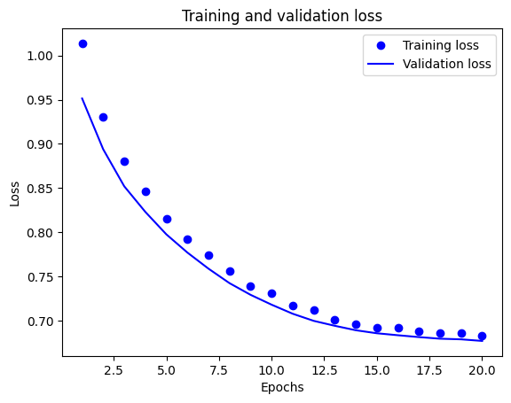
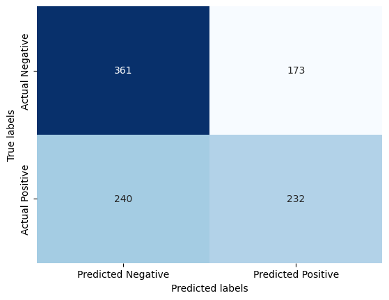

# NFL-Game-Predictor
A deep learning model trained to forecast NFL game results based on past data

---

## Project Overview

This project aims to predict the outcome of American football games using deep learning techniques. The model predicts whether the home team will cover the point spread or not, based on game and betting data. A total of 8 models were trained, including one logistic regression and seven neural network models, using various regularization techniques and dropout layers to optimize performance.

---

## Dataset

The dataset was sourced using the nfl-data-py Python library, which provides game and seasonal data. It contains 6,706 observations and 46 columns, including information about teams, players, game conditions, and betting data. After extensive preprocessing and feature engineering, 24 features were selected and further reduced to 9 based on feature importance.

### Variable Dictionary
| Variable               | Description                                                       |
|-----------------------|-------------------------------------------------------------------|
| week                  | The week of the season in which the game is being played.           |
| gametime               | The time at which the game starts.                                 |
| home_spread            | The spread assigned to the home team.                              |
| div_game               | Whether it is a divisional game or not.                            |
| home_qb_encoded        | The encoding of the quarterback of the home team.                   |
| away_qb_encoded        | The encoding of the quarterback of the away team.                   |
| home_coach_encoded     | The encoding of the coach of the home team.                         |
| away_coach_encoded     | The encoding of the coach of the away team.                         |
| home_cover_spread      | Whether the home team covers the spread or not.                     |

---

## Data Preprocessing and Feature Engineering

The preprocessing and feature engineering steps were essential to ensure the quality of the data and improve model performance. Key steps included:

- Dropping Unnecessary Columns: Removed irrelevant features such as game odds and referee information.

- Renaming Columns: Made column names simpler and more consistent.

- Handling Missing Values: Imputed missing data with averages (for numerical) or mode (for categorical).

- Changing Data Types: Reduced memory usage by converting data types.

- Feature Engineering: Created a target variable (home_cover) and performed one-hot encoding for categorical features.

- Data Splitting and Standardization: Divided the dataset into training (70%), validation (15%), and testing (15%) sets and standardized numerical features.

---

## Models

Eight different models were tested to evaluate various techniques for predicting game outcomes. These models range from a simple logistic regression baseline to advanced neural networks with dropout, regularization, and data balancing techniques. Below is a list of the tested models and their performance metrics.

- Logistic Regression (Baseline) - A simple linear model used to establish a baseline for comparison.

- Basic Neural Network (No Regularization) - A simple feedforward neural network without any regularization techniques.

- Neural Network with Dropout Layers - A neural network with dropout layers added to reduce overfitting.

- Neural Network with L1 Regularization (Lasso) - A neural network that uses L1 regularization to reduce overfitting.

- Neural Network with L2 Regularization (Ridge) - A neural network that uses L2 regularization to reduce overfitting.

- Neural Network with Batch Normalization - A neural network that includes batch normalization layers to stabilize and accelerate training.

- Neural Network with SMOTE for Imbalance Handling - A neural network that uses Synthetic Minority Over-sampling Technique to balance classes.

- Neural Network with Combined Techniques (Best Model) - A neural network that combines the best-performing techniques from previous models to achieve optimal accuracy.

---

## Results

The best model achieved a validation accuracy of 61.63% and a test accuracy of 59%, demonstrating the ability to generalize well despite the relatively small dataset size.
For a detailed analysis of the results and methodology, please refer to the full [report](report.pdf).

    

        
        
Training

    

    

        
        
Confusion Matrix

    

# Classification Report

| Class | Precision | Recall | F1-Score | Support |
|------|----------|-------|---------|--------|
| 0    | 0.60     | 0.68  | 0.64    | 534    |
| 1    | 0.57     | 0.49  | 0.53    | 472    |
|      |          |       |         |        |
| Accuracy      |        |       | 0.59    | 1006   |
| Macro Avg     | 0.59   | 0.58  | 0.58    | 1006   |
| Weighted Avg  | 0.59   | 0.59  | 0.59    | 1006   |

---

## Challenges

One of the main challenges was balancing the classes and preventing overfitting, as the dataset had slight class imbalance. Techniques like dropout layers and L1 regularization were crucial to improving model robustness.

## Acknowledgements

Special thanks to Professor Zoran Djordjevic and colleagues who supported the project.

